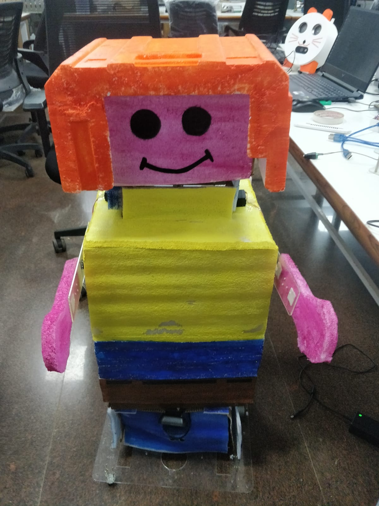
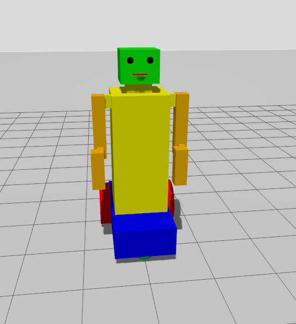

# 🤖 Humanoid Dancing Robot – Gazebo Simulation & Real Hardware

A humanoid robot capable of performing synchronized dance movements in both **Gazebo simulation** and **real-world hardware** using **Arduino**, and **Raspberry Pi**.

The project demonstrates a complete **Sim-to-Real Robotics Pipeline**, where the same dance motions developed and tested in Gazebo are executed on a physical humanoid robot through coordinated servo control.

<p align="center">
  
</p>

<br></br>

<p align="center">
  
</p>


---

# 📖 Overview

This project focuses on developing a humanoid robot capable of executing coordinated dance sequences involving:

- Head movements
- Arm gestures
- Body coordination
- Synchronized multi-joint motions

The robot was first modeled and tested in **Gazebo Simulation** using ROS2 control architecture and then deployed onto a real humanoid robot powered by:

- Raspberry Pi
- Arduino
- Servo Motors

The same movement logic was transferred from simulation to hardware, demonstrating successful **Sim-to-Real Motion Transfer**.

---

# 🎯 Objectives

- Design a humanoid robot model in Gazebo.
- Develop coordinated dance routines.
- Control multiple joints simultaneously.
- Interface Arduino with servo motors.
- Use Raspberry Pi for high-level processing.
- Transfer simulated motions to real hardware.
- Achieve smooth and synchronized movements.

---

# ⚙️ System Architecture

```text                      
                      
            Dance Motion Generator
                      │
                      ▼
          Joint Position Commands
                      │
        ┌─────────────┴─────────────┐
        ▼                           ▼
   Gazebo Robot              Raspberry Pi
   Simulation                High-Level Control
                                     │
                                     ▼
                                Arduino
                                     │
                                     ▼
                             Servo Motors
                                     │
                                     ▼
                            Humanoid Robot
```

---

# 🛠 Hardware Used

## Controller

- Raspberry Pi
- Arduino Nano / Uno

## Actuators

- MG90S Servo Motors
- SG90 Servo Motors

## Power

- 12V Battery Pack
- Buck Converter

## Communication

- USB Serial Communication

---

# 💻 Software Stack

## Operating System

- Ubuntu 22.04

## Frameworks

- Gazebo

## Languages

- Python
- C++

---

# 🌐 Gazebo Simulation

The complete robot is simulated in Gazebo before deployment.

### Features

- Realistic joint movement
- Physics-based simulation
- Motion validation before hardware testing

---

# 🔧 Real Hardware Implementation

After validating motion in Gazebo, the same joint commands are sent to the physical robot.

### Raspberry Pi Responsibilities

- Generate dance motions
- Send commands to Arduino
- Coordinate joint synchronization

### Arduino Responsibilities

- Receive joint commands
- Generate servo PWM signals
- Control multiple servo motors
- Execute precise movements

---

# 🔄 Sim-to-Real Transfer

One of the primary goals of this project is ensuring that motions developed in simulation behave similarly on real hardware.

### Process

```text
Dance Logic
      │
      ▼
Gazebo Testing
      │
      ▼
Motion Verification
      │
      ▼
Deploy to Raspberry Pi
      │
      ▼
Arduino Servo Control
      │
      ▼
Real Humanoid Motion
```

---

# 📂 Project Structure

```text
Humanoid_Dancing_Robot/
│
├── gazebo/
│   ├── robot_model
│   ├── worlds
│   └── launch
│
├── ros2_nodes/
│   ├── dance_controller.py
│   ├── motion_generator.py
│   └── serial_bridge.py
│
├── arduino/
│   └── servo_controller.ino
│
├── images/
│   ├── humanoid.png
│   ├── gazebo.png
│   └── hardware.png
│
├── launch/
│   └── start_robot.launch.py
│
└── README.md
```

---

# 📈 Learning Outcomes

This project demonstrates concepts from:

- Robotics Simulation
- Gazebo Physics Engine
- Embedded Systems
- Servo Motor Control
- Raspberry Pi Programming
- Arduino Programming
- Motion Planning
- Robot Kinematics
- Sim-to-Real Transfer
- Multi-Joint Synchronization

---

# 🏆 Outcome

A fully functional humanoid robot capable of performing synchronized dance movements in both **Gazebo simulation** and **real-world hardware**, demonstrating seamless integration between ROS2, Raspberry Pi, Arduino, and servo-based robotic actuation.

The project successfully bridges simulation and physical deployment, showcasing practical applications of robotics control, embedded systems, and human-like motion generation.

---

#  Contributions

Coding is done by me for both the simulation as well as the real bot. Huge contribution done by Yenepoya university students in assembling the bot and making the connections. Rajid Rahman was fabulous in his work in setting up the robot. Thanks to Vipula from TCE as well for contributing in painting the bot. 
